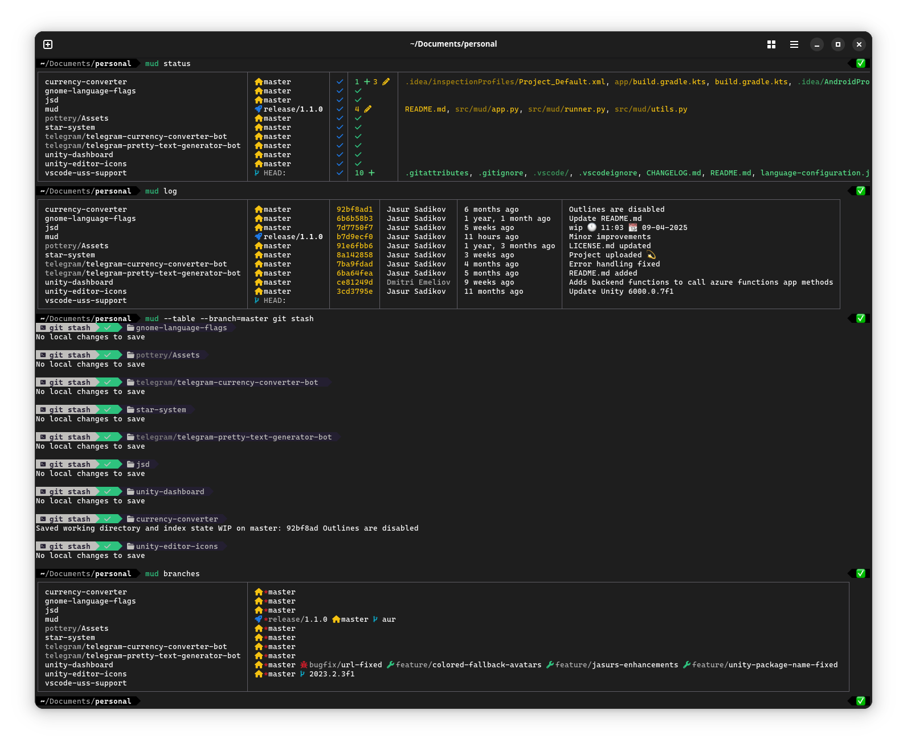

# mud


[](https://github.com/jasursadikov/mud/actions/workflows/test.yaml)
[](https://github.com/jasursadikov/mud/actions/workflows/publish-pypi.yaml)
[](https://github.com/jasursadikov/mud/actions/workflows/publish-aur.yaml)



mud is a multi-directory git runner that allows you to run git commands in multiple repositories. It has multiple powerful filtering tools and support for aliasing. This tool is not limited to git commands only; you can run any commands as you wish. However, this tool was primarily designed to be used with git, so each referenced directory should have a `.git` directory.

## Installing
For PyPI
```bash
pip install mud-git
```
For Arch Linux
```bash
paru -S mud-git
```

## Getting started

1. Run `mud config` to start an interactive wizard that helps you set the preferred settings. Check the [settings](#settings) section for more details. At the end, a `.mudsettings` file will appear in your home directory, which you can modify in the future.
2. Navigate to your preferred directory with repositories.
3. Run the `mud init` command to create a `.mudconfig` file. This file is important for keeping references to repositories. All repositories in the current directory will be included in `.mudconfig`.
4. Optional: Run [`mud set-global`](#commands) to make the current configuration default and accessible from any directory.

All entries are stored in `.mudconfig` in TSV format. After making your first entry, you can open `.mudconfig` in a text editor and modify it according to your needs.

## Using

### Commands

- `mud set-global` - sets the current `.mudconfig` as a global configuration so it will be used as a fallback configuration to run from any directory.
- `mud get-config` - prints the closest `.mudconfig` location.

`mud <FILTER> <COMMAND>` will execute a bash command across all repositories. To filter repositories, check the [arguments](#arguments) section.
- `mud info`/`mud i` - displays branch divergence and working directory changes.
- `mud status`/`mud st` - displays working directory changes.
- `mud log`/`mud l` - displays the latest commit message, its time, and its author.
- `mud labels`/`mud lb` - displays mud labels across repositories.
- `mud branch`/`mud br` - displays all branches in repositories.
- `mud remote-branch`/`mud rbr` - displays all remote branches in repositories.
- `mud tags`/`mud t` - displays git tags in repositories.

### Arguments
- `-l=<label>` or `--label=<label>` - includes repositories with the provided label.
- `-nl=<label>` or `--not-label=<label>` - excludes repositories with the provided label.
- `-b=<branch>` or `--branch=<branch>` - includes repositories with the provided branch.
- `-nb=<branch>` or `--not-branch=<branch>` - excludes repositories with the provided branch.
- `-c` or `--command` - explicit command argument. Use this whenever you're trying to run a complex command.
- `-m` or `--modified` - filters out modified repositories.
- `-d` or `--diverged` - filters repositories with diverged branches.
- `-t` or `--table` - toggles the default table view setting for execution.
- `-a` or `--async` - toggles the asynchronous execution feature.

Example:

```bash
# Filters out all repos with the master branch and diverged branches and then runs the pull command.
mud -b=master -d git pull

# Fetches all repositories that are not on the master branch and have the "personal" label, excluding those with the "work" label.
mud -nb=master -l=personal -nl=work git fetch
```

## Settings

Settings are stored in your home directory in the `.mudsettings` file.

- `run_async = 0/1` - enables asynchronous commands.
- `run_table = 0/1` - enables table view for asynchronous commands. Requires `run_async`.
- `nerd_fonts = 0/1` - enables nerd fonts in the output 💅.
- `show_borders = 0/1` - enables borders in the table view.
- `collapse_paths = 0/1` - simplifies branch names in the branch view.
- `config_path = /home/user/path/.mudconfig` - this is set by the `mud set-global` command.

### Aliases

You can create your own aliases. To do so, edit the `[alias]` section of the `.mudsettings` file. The `.mudsettings` file has the following aliases by default:
```
[alias]
to = git checkout
fetch = git fetch
pull = git pull
push = git push
```

## Labeling

You can modify your `.mudconfig` file using the following commands:

### Adding and labeling repositories

-   `mud add <label> <path>` - adds a path with an optional label.
-   `mud add <path>` - adds a path without a label.

### Removing labels and repositories

-   `mud remove <label>` - removes the label from all directories.
-   `mud remove <path>` - removes the directory with the specified path.
-   `mud remove <label> <path>` - removes the label from a directory.
